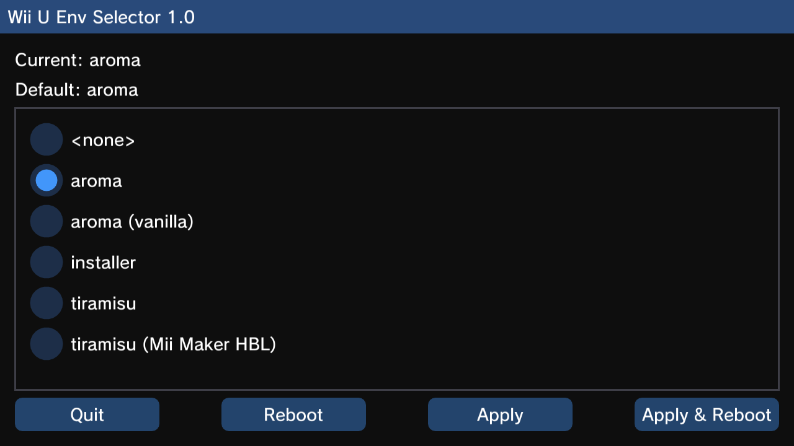

# Wii U Env Selector

A Wii U app to set the default boot environment.

Use this app if you have multiple environments (like Tiramisu and Aroma, or multiple Aroma
environments) and want change the default environment, without having to hold X during boot.

This app is similar in functionality to [envSwap](https://hb-app.store/wiiu/EnvSwap) but it's
not hardcoded to switch between "aroma" and "tiramisu". You can select any existing environment,
using any controller or the touch screen.

## Usage

Select the environment you want to set as default, then press the "Apply & Reboot" button.

